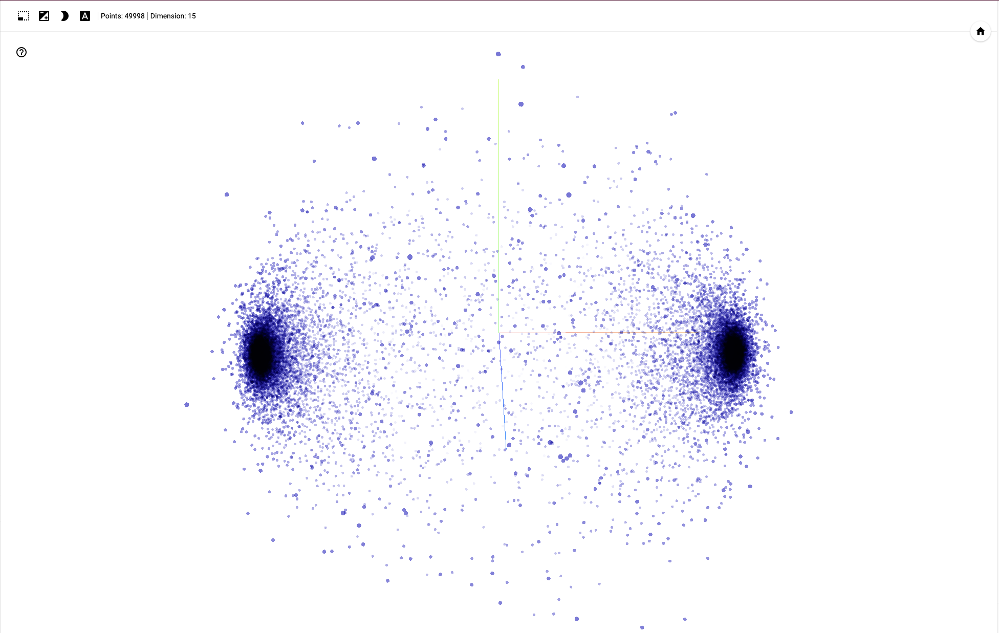

# IMDb Sentiment Analysis with TensorFlow


## About the Project

This repository contains a sentiment analysis project using the IMDb dataset of 50,000 movie reviews. The goal of this project is to analyze (with NLP techniques) and perform binary sentiment classification on movie reviews, predicting whether a review is positive or negative using TensorFlow and machine learning techniques.

## Dataset

The dataset used in this project is the [IMDB Dataset of 50K Movie Reviews](https://www.kaggle.com/datasets/lakshmi25npathi/imdb-dataset-of-50k-movie-reviews) from Kaggle. It consists of 50,000 movie reviews. Each review is labeled as positive or negative.

## Getting Started

Follow these steps to get started with the project:

1. Clone this repository.
2. Download the IMDb dataset from [Kaggle](https://www.kaggle.com/datasets/lakshmi25npathi/imdb-dataset-of-50k-movie-reviews) and place it in the `data` directory.
3. Install the required dependencies listed in `requirements.txt` by using:

    ```bash
    > pip install -r requirements.txt
    ```

    N.B. I've used `python 3.11.4`

4. Run the provided Jupyter Notebook to train and evaluate your sentiment analysis model.

## Usage

1. **Data Preparation**

   - The project starts by reading the IMDB dataset from the 'Data/IMDB_Dataset.csv' file.
   - The 'sentiment' column is converted to binary values (0 for negative, 1 for positive).

2. **Data Splitting**

   - The dataset is shuffled, and 80% of it is used for training, while 20% is reserved for testing.

3. **Text Preprocessing**

   - Text data is cleaned by removing stopwords, punctuation, and HTML tags.
   - The word cloud visualization is generated to visualize the cleaned data.

4. **Tokenization**

   - Tokenization is performed to convert text data into numerical format.
   - The data is tokenized and padded to have a consistent length for input.

5. **Model Creation**

   - A deep learning model is defined using TensorFlow and Keras.
   - The model architecture includes an embedding layer, a global average pooling layer, and dense layers.
   - The model is trained on the training data and validated on the validation data.

6. **Model Training and Evaluation**

   - The model is trained using 100 epochs.
   - Training and validation accuracy and loss are visualized.

7. **Model Evaluation**

   - The model is evaluated on the testing data to assess its performance.

8. **Make Predictions**

   - You can make predictions on new text data using the trained model.

9. **Embedding Visualization (Optional)**

    
    - The word embeddings learned by the model can be visualized using [TensorFlow Projector](https://projector.tensorflow.org/).

## File Structure

```text
- project_root/
    ├── sentiment_analysis.ipynb
    ├── Data/
    │   └── IMDB_Dataset.csv
    ├── data/
    │   ├── vector.tsv
    │   └── metadata.tsv
    ├── doc/
    │   └── Embedding.png
    ├── model/
    │   └── (Trained model)
    └── training/
        └── (Training checkpoints)
```

- `sentiment_analysis.ipynb`: Jupyter Notebook containing the complete code.
- `data/IMDB_Dataset.csv`: Dataset used this project.
- `data/vector.tsv`: TSV file for word embeddings visualization (optional).
- `data/metadata.tsv`: TSV file for word embeddings metadata (optional).
- `model/`: Directory for storing the trained model.
- `training/`: Directory for storing training checkpoints.

## License

This project is licensed under the MIT License. Feel free to use, modify, and distribute the code and associated resources.
